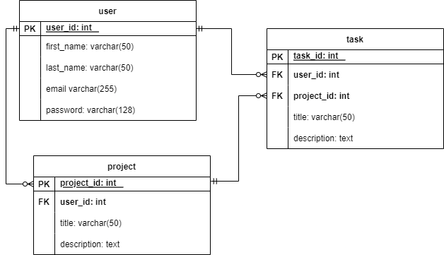

# Badhe Ngelakoni

# Problem Description
In order to measure the efficiency of their employee, Ridwan a project manager on a company want to know the progress of their fellow workers.  In order to do that as a web developer I decide to collaborate with him to create a simple todo application, with functionality that we've discussed.

# Requirements
In order to fulfill Ridwan's request here are some requirement I've decided upon:

## Technical Requirement
- Python 3.10 or higher
- Javascript ES6
- Flask Framework
- Postman
- Postgres DB
- Docker
- Docker Compose

## Bussiness Requirement
- User able to authenticate before entering the application home
- User could create a task related to project they are currently working on
- User could create a new task, edit, and mark it as done
- User could change project
- There are tag that show which tag belong to which project

## ERD



# How to run

```
    # With Python Environment

    # Build virtual environment
    python3 -m venv .venv
    source .venv/bin/activate

    # Install dependencies
    cd backend
    pip install -r requirements.txt

    # Edit the .env-example with your own config and rename it to .env

    # Flask db migration command
    flask db init
    flask db migrate -m "Init migration"
    flask db upgrade

    # Run project
    flask --app app run
    ----------------------------------------------------------------
    # With Docker Compose 

    # Build file
    docker compose up

    # Enter into flask container bash shell 
    docker exec -it ngelakoni-app bash

    # Flask db migration command
    flask db init
    flask db migrate -m "Init migration"
    flask db upgrade

    # Check whether the migration success, enter postgre container bash shell
    docker exec -it ngelakoni-db bash

    # Login postgres
    psql -U postgres ngelakoni_app
    # Check tables
    \dt
    select * from alembic_version;
    # If there is version_num the migration is success

    # Open 127.0.0.1:5000
```