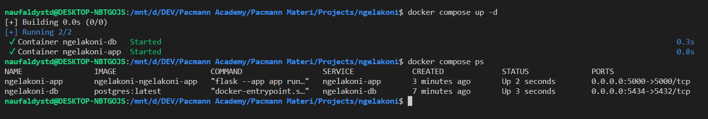
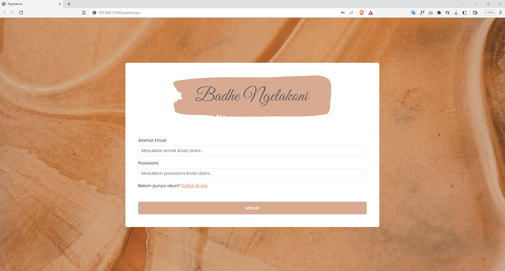
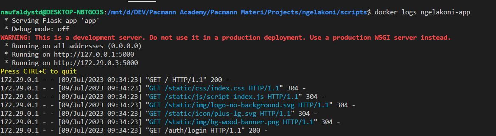
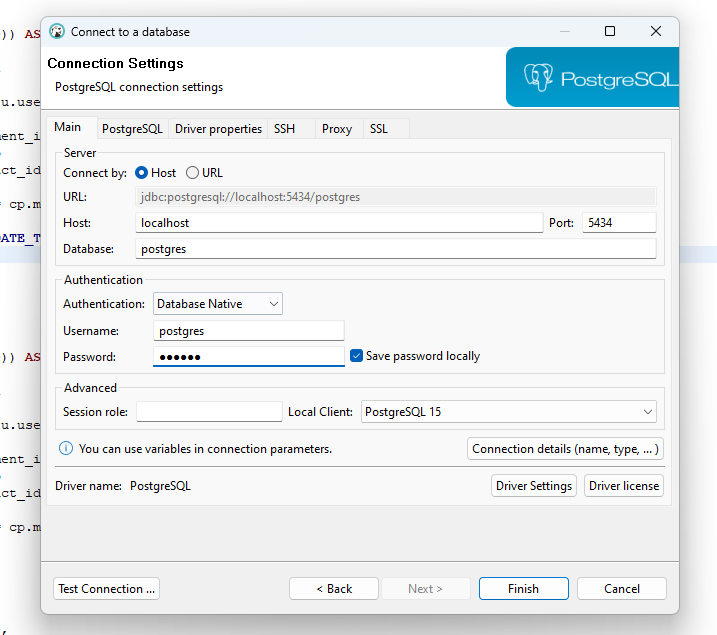
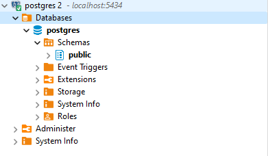
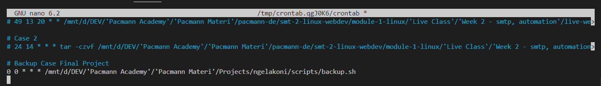
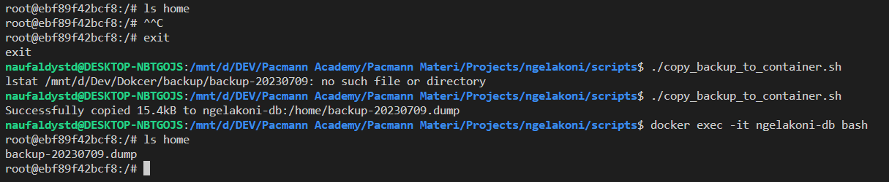
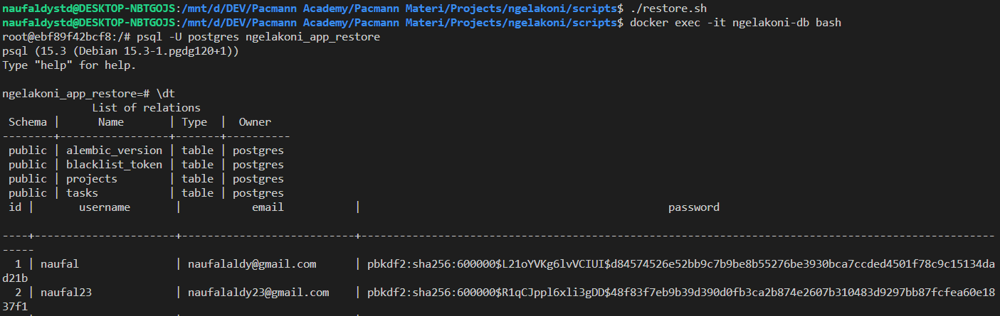

# Dockerized Flask, and Scripts Documentation

This README is intended for Linux & Container final project

# Problem Description

In order for this application able to be deployed in any kind of environment, I as a Software/Data Engineer dockerized this application and also created scripts for backup-restore the database.

# Requirements
- Linux environment
- Text Editor
- Docker
- Docker Compose
- Dbeaver
- Cron

# Project Run Documentation

### Docker and Docker Compose 
1. Run docker compose and check whether the container already up
    ```
    # Run build docker compose
    docker compose up -d

    # Check if there's 2 service already up
    docker compose ps
    ```

    

2. Open localhost:5000, to see if the project already up.  You can also check docker logs to see the log of flask container
    ```
    docker logs ngelakoni-app
    ```

    

    The logs will looks like below image:

    

3. Open dbeaver, and connect to the postgres inside docker container based on the docker compose environment(port, password, etc).  

    

    If success there will be green checkmark.

    


### Backup and Restore Script
1. Run backup script manually
    ```
    cd scripts
    ./backup.sh

    # You will be prompted the password of db, enter it just like in docker compose
    ```
    

2. Schedule Backup with cron
    ```
    crontab -e

    0 0 * * * /path/to/script # This will run the backup script every day at midnight, because the first 0 represents minutes and the second one represent hours, which basically 00:00 A.M.
    ```

    

3. Restore db
    ```
    # First copy the backup.dump file from host to container
    ./copy_backup_to_container.sh

    # Check if the file has been copied
    docker exec -it ngelakoni-db bash
    ls home
    ```

    

    ```
    # Finally run restore.sh
    ./restore.sh

    # Enter postgres container
    docker exec -it ngelakoni-db bash

    # Enter psql shell
    psql -U postgres ngelakoni_app_restore
    ```

    Data will also be successfully restored like below:

    
